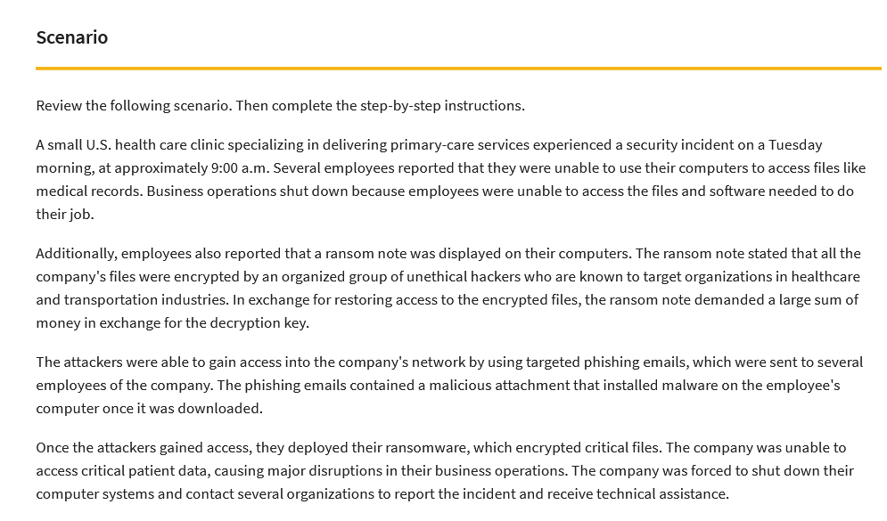

# Google-Cert-Document-an-Incident
A project made in Google Cybersecurity Certificate called "Document an incident with an incident handler's journal".

I was given the following scenario:

I used an Incident handler's journal template to create my own work in "Incident handler's journal.pdf" file. 
